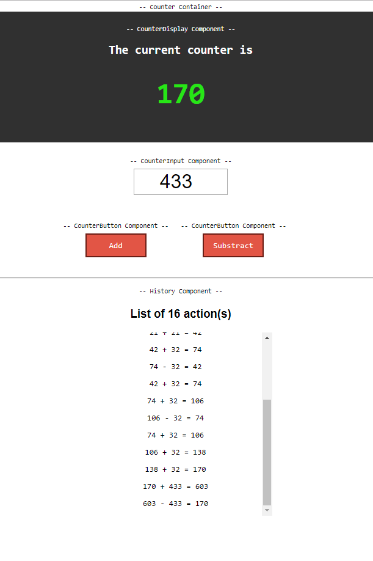

# React-redux
The goal of this lab is to learn how React communicate with Redux using **redux** and **react-redux**

The usage of Redux is overkill for this context as I only have few objects to store, but I kept it simple for the learning purpose.

## Demo 
The demo can be found here : https://leyka.github.io/counter

## Concepts I learned while doing this 

* One global store
* Immutable state => we can track actions!
* Dispatch / Reducer 
* Presentational VS Container Components
* [Action creators](https://redux.js.org/docs/basics/Actions.html)
* Map state to Container Props
* Map dispatch to Container Props 
* Connect (from react-redux library)
* [Controlled input](https://reactjs.org/docs/forms.html)
* Redux DevTools Extension (Chrome)

## Preview

User can add a random value and add it or substract it to the current counter

As the store is immutable, we can keep a history of the store (List of actions)

