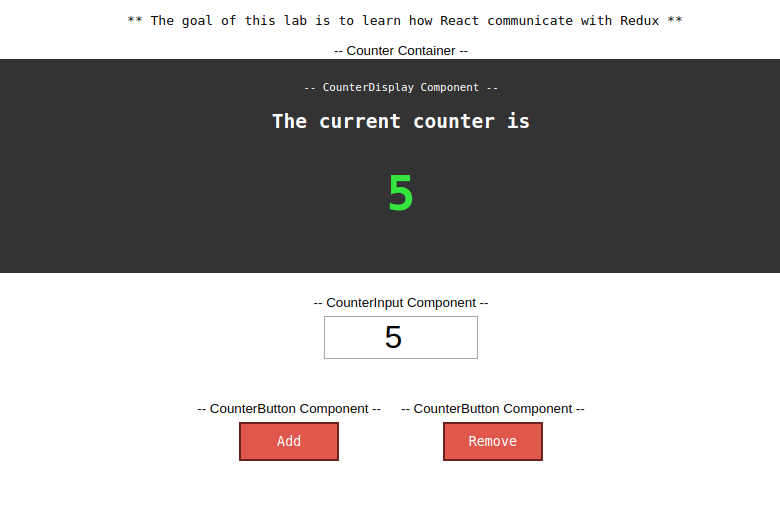

# React-redux
The goal of this lab is to learn how React communicate with Redux. 
Understand what's the purpose of a container, component, etc.
And how we can pass the state (handling props), dispatch actions within a container etc.

